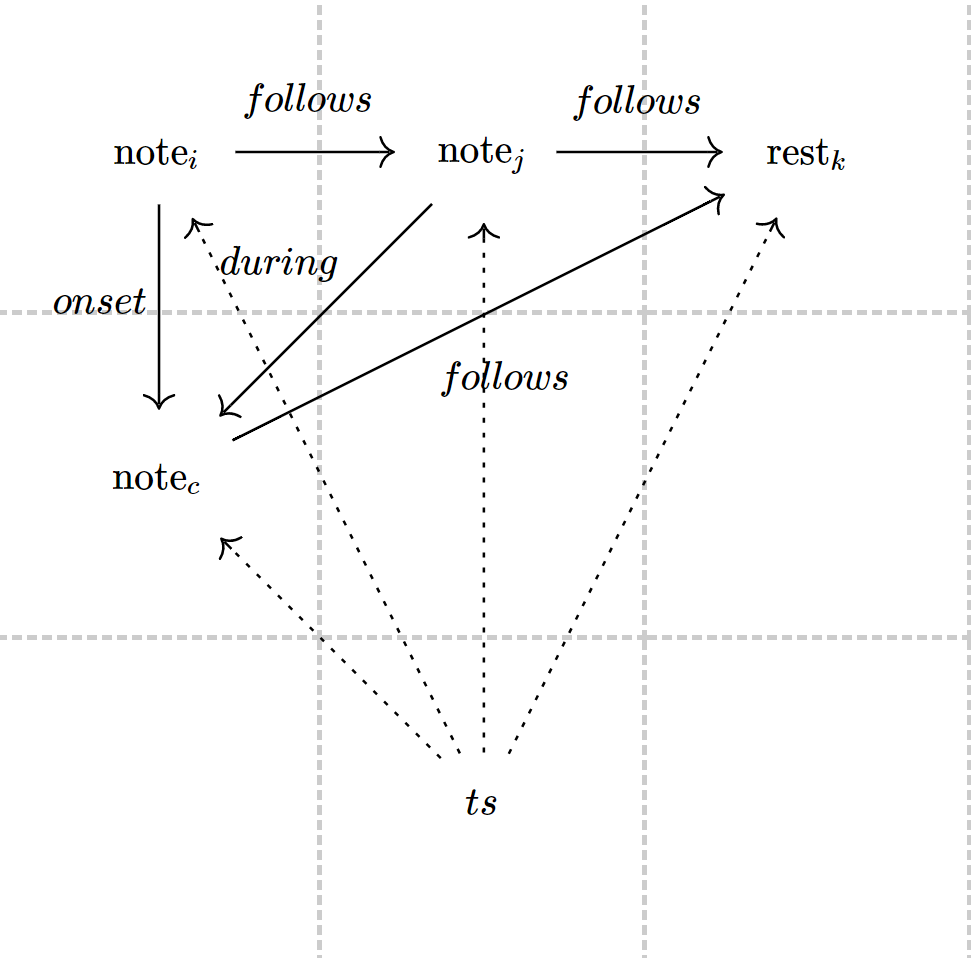

# musym-GDL
Geometric Deep Learning Applied on Symbolic Music Scores

Overview
--------

Cadence and Voice Leading Detection in Symbolic Classical Music is a challenging task. This Repository provides method for Geometrical Deep Learning models and score graph modelling paradigms for applying Node Classification on Musical Score graphs for Cadence Detection.


#### A typical Heterogenous graph modelling of the musical score




## Dependencies

- pytorch  1+

- dgl v0.6

- pandas

  

### Quickstart

Install requirements with pip: 

```shell
pip install -r requirements.txt
```

Run a experiment :

```shell
cd src/models/rgcn-homo
python entity_classify.py -d cora --testing --gpu 0
```

