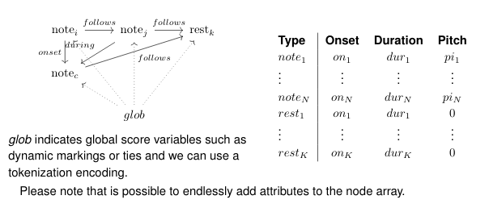
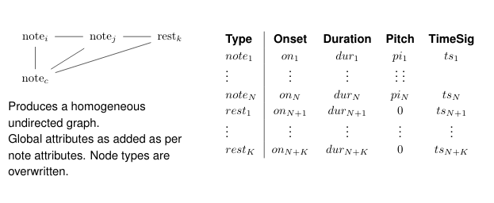

# musym-GDL
Geometric Deep Learning Applied on Symbolic Music Scores

Overview
--------

Cadence and Voice Leading Detection in Symbolic Classical Music is a challenging task. This Repository provides method for Geometrical Deep Learning models and score graph modelling paradigms for applying Node Classification on Musical Score graphs for Cadence Detection.


#### A typical Heterogenous graph modelling of the musical score




#### Equivalent Homogenous graph modelling for the musical score




## Dependencies

- pytorch  1+
- dgl v0.7
- pytorch-lightning 1.3.4
- wandb
- ray
- pyro-ppl


### Quickstart

Install requirements with pip: 

```shell
pip install -r requirements.txt
```

#### Quickstart with Conda

```shell
conda env create -f environment.yml
```
Followed by
```shell
conda activate musym
```

### Run a experiment

```shell
cd musym/benchmark/
python bench.py --model SAGE --dataset cora
```

